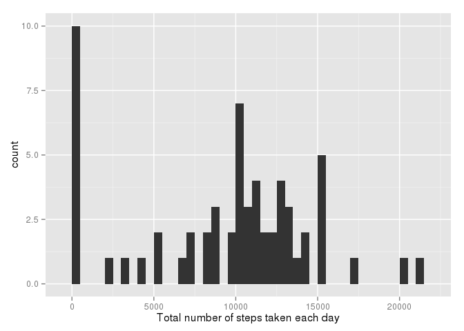
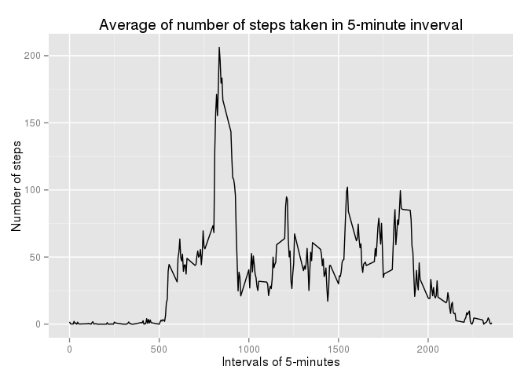
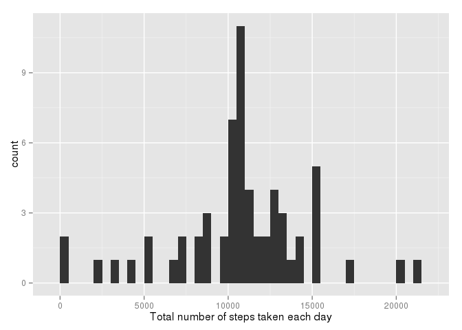
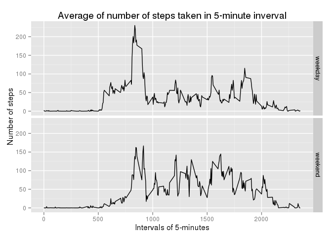

# Reproducible Research: Peer Assessment 1


## Loading and preprocessing the data


```r
a <- read.csv("activity.csv")
dim(a)
```

```
## [1] 17568     3
```

```r
head(a,3)
```

```
##   steps       date interval
## 1    NA 2012-10-01        0
## 2    NA 2012-10-01        5
## 3    NA 2012-10-01       10
```

```r
str(a)
```

```
## 'data.frame':	17568 obs. of  3 variables:
##  $ steps   : int  NA NA NA NA NA NA NA NA NA NA ...
##  $ date    : Factor w/ 61 levels "2012-10-01","2012-10-02",..: 1 1 1 1 1 1 1 1 1 1 ...
##  $ interval: int  0 5 10 15 20 25 30 35 40 45 ...
```

## What is mean total number of steps taken per day?

For this part of the assignment, you can ignore the missing values in the dataset.

1. Make a histogram of the total number of steps taken each day


```r
library(ggplot2)
a1 <- tapply(a$steps, a$date, sum, na.rm=T)
qplot(a1, geom="histogram", xlab="Total number of steps taken each day", binwidth=500)
```

 

2. Calculate and report the mean and median total number of steps taken per day


```r
dailytotalmean <- round(mean(a1),0)
dailytotalmedian <- median(a1)
```
The mean total number of steps taken per day is 9354.  
The median total number of steps taken per day is 10395.


## What is the average daily activity pattern?

1. Make a time series plot (i.e. type = "l") of the 5-minute interval (x-axis) and the average number of steps taken, averaged across all days (y-axis)


```r
a2 <- tapply(a$steps, a$interval, mean, na.rm=T)
qplot(x=as.integer(names(a2)), 
      y=as.vector(a2), 
      geom="line", 
      main="Average of number of steps taken in 5-minute inverval", 
      xlab="Intervals of 5-minutes", 
      ylab="Number of steps")
```

 

2. Which 5-minute interval, on average across all the days in the dataset, contains the maximum number of steps?


```r
maxstep <- which(a2==max(a2))
maxstep <- as.integer(names(maxstep))
```
The 5-minute interval that contains the maximum number of steps on average across all days in the data set is 835. 

## Imputing missing values
Note that there are a number of days/intervals where there are missing values (coded as NA). The presence of missing days may introduce bias into some calculations or summaries of the data.

1. Calculate and report the total number of missing values in the dataset (i.e. the total number of rows with NAs)


```r
numofNAs <- sum(is.na(a$steps))
```
The total number of missing values in the dataset is 2304.

2. Devise a strategy for filling in all of the missing values in the dataset. The strategy does not need to be sophisticated. For example, you could use the mean/median for that day, or the mean for that 5-minute interval, etc

The strategy used here is to replace NAs with the mean for that 5-minute interval across all the days in the dataset.

3. Create a new dataset that is equal to the original dataset but with the missing data filled in.


```r
flagNA <- is.na(a$steps)
a2 <- cbind(as.integer(rownames(a2)),a2) 
# convert a2 into two column matrix, the 1st column as invervals, 2nd column as mean
aNoNA <- a
aNoNA[flagNA,1] <- sapply(a[flagNA, 3], function(x)round(a2[which(a2[,1]==x),2],0))
```
4. Make a histogram of the total number of steps taken each day and Calculate and report the mean and median total number of steps taken per day. Do these values differ from the estimates from the first part of the assignment? What is the impact of imputing missing data on the estimates of the total daily number of steps?


```r
dailytotal <- tapply(aNoNA$steps, a$date, sum, na.rm=T)
qplot(dailytotal, geom="histogram", xlab="Total number of steps taken each day", binwidth=500)
```

 

```r
dailytotalmeanNoNA <- round(mean(dailytotal),0)
dailytotalmedianNoNA <- median(dailytotal)
```

The mean total number of steps taken per day after imputing missing data is 10766.  
The median total number of steps taken per day after imputing missing data is 10762.

Both the mean and the median values increased from those calculated from the data set with missing values, which is understandable since missing values are not counted in calculating the sum for each day. Now the missing values are filled with positive values, the sum will surely increase. Notice that the number of days with 0-500 steps is decreased from 10, the highest in the first histogram, to 2 when missing values are imputed. This shows that imputing missing data can help correct skewed data because of missing data. 

## Are there differences in activity patterns between weekdays and weekends?

For this part the weekdays() function may be of some help here. Use the dataset with the filled-in missing values for this part.

1. Create a new factor variable in the dataset with two levels ??? ???weekday??? and ???weekend??? indicating whether a given date is a weekday or weekend day.


```r
library(lubridate)
numwkday <- wday(as.Date(a[,2]))
wkd <- sapply(numwkday, function(x){
    if(x==1 | x==7) return("weekend")
    else return("weekday")})
wkd <- factor(wkd)
aNoNA <- cbind(aNoNA, wkd)
```


2. Make a panel plot containing a time series plot (i.e. type = "l") of the 5-minute interval (x-axis) and the average number of steps taken, averaged across all weekday days or weekend days (y-axis). See the README file in the GitHub repository to see an example of what this plot should look like using simulated data.


```r
a5 <- aggregate(steps ~ interval + wkd, aNoNA, mean, simplify=F)
meansteps <- as.vector(unlist(a5$steps))
a5 <- cbind(a5, meansteps)
qplot(interval, meansteps, 
      data=a5, 
      facets=wkd~., 
      geom="line",
      main="Average of number of steps taken in 5-minute inverval", 
      xlab="Intervals of 5-minutes", 
      ylab="Number of steps")
```

 
